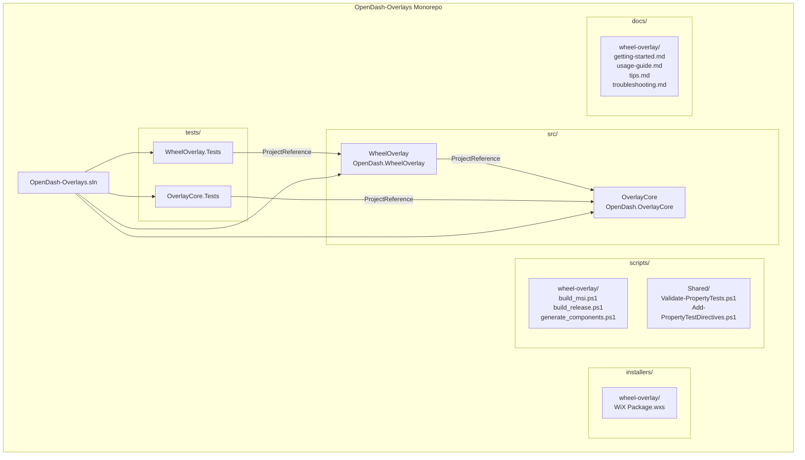
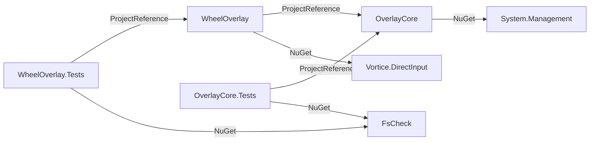
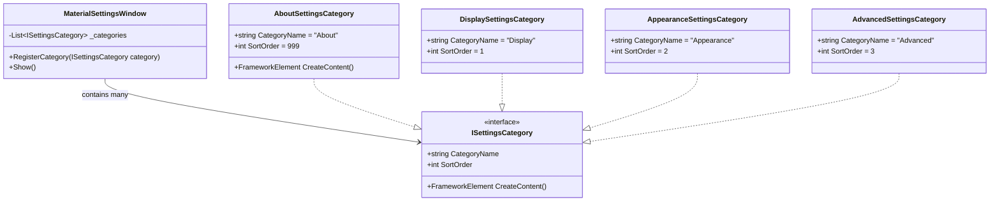
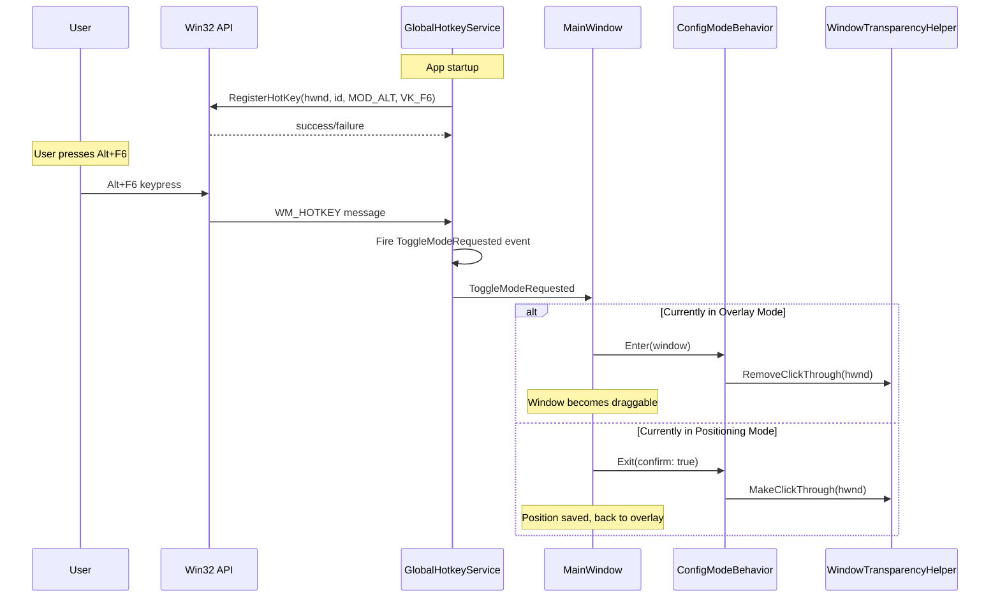

# Design Document: OpenDash Monorepo Rebrand

## Overview

This design restructures the existing WheelOverlay single-app repository into a monorepo called "OpenDash-Overlays." The restructuring extracts shared overlay infrastructure into an `OverlayCore` class library, migrates WheelOverlay to consume it via ProjectReference, introduces per-app CI/CD with path filters and tag-based triggers, refactors the settings UI into a Material Design-inspired XAML framework, bundles shared font resources, creates user documentation, and adds a global Alt+F6 hotkey for cycling overlay modes.

The key design decisions are:

1. **Monorepo with ProjectReference** (not NuGet): OverlayCore is compiled from source alongside each overlay app. This avoids package versioning complexity and enables atomic cross-project changes.
2. **Namespace rebrand to `OpenDash.*`**: All code moves under `OpenDash.OverlayCore` and `OpenDash.WheelOverlay` namespaces.
3. **Settings framework in OverlayCore**: A base `SettingsWindow` with Material Design-inspired XAML styles replaces the procedural code-behind. Overlay apps register category panels.
4. **Global hotkey via Win32 RegisterHotKey**: OverlayCore registers Alt+F6 system-wide and exposes mode cycling through a shared service.
5. **Tag-based + path-based CI/CD**: Both trigger mechanisms coexist, with tag triggers validating version consistency against the .csproj.

## Architecture

### High-Level Component Diagram



### Monorepo Directory Structure

```
OpenDash-Overlays/
├── OpenDash-Overlays.sln
├── README.md
├── CHANGELOG.md
├── CONTRIBUTING.md
├── LICENSE.txt
├── nuget.config
├── .gitignore
├── assets/
│   ├── icons/
│   │   ├── wheel_overlay_light.ico
│   │   ├── wheel_overlay_dark.ico
│   │   └── generated/
│   └── rotary_knob/
├── src/
│   ├── OverlayCore/
│   │   ├── OverlayCore.csproj
│   │   ├── Services/
│   │   │   ├── ThemeService.cs
│   │   │   ├── LogService.cs
│   │   │   ├── ProcessMonitor.cs
│   │   │   ├── WindowTransparencyHelper.cs
│   │   │   ├── GlobalHotkeyService.cs
│   │   │   └── SystemTrayScaffold.cs
│   │   ├── Models/
│   │   │   └── ThemePreference.cs
│   │   ├── Behaviors/
│   │   │   ├── ConfigModeBehavior.cs
│   │   │   └── BaseOverlayWindow.cs
│   │   ├── Settings/
│   │   │   ├── MaterialSettingsWindow.xaml
│   │   │   ├── MaterialSettingsWindow.xaml.cs
│   │   │   ├── ISettingsCategory.cs
│   │   │   ├── AboutSettingsCategory.xaml
│   │   │   ├── AboutSettingsCategory.xaml.cs
│   │   │   └── Styles/
│   │   │       └── MaterialStyles.xaml
│   │   └── Resources/
│   │       ├── Fonts/
│   │       │   ├── SharedFontResources.xaml
│   │       │   └── FontUtilities.cs
│   │       ├── DarkTheme.xaml
│   │       └── LightTheme.xaml
│   └── WheelOverlay/
│       ├── WheelOverlay.csproj
│       ├── Program.cs
│       ├── App.xaml / App.xaml.cs
│       ├── MainWindow.xaml / MainWindow.xaml.cs
│       ├── AssemblyInfo.cs
│       ├── VersionInfo.cs
│       ├── Models/
│       │   ├── AppSettings.cs
│       │   ├── Profile.cs
│       │   ├── WheelDefinition.cs
│       │   ├── DialPositionConfig.cs
│       │   ├── GridPositionItem.cs
│       │   ├── LayoutValidator.cs
│       │   └── ProfileValidator.cs
│       ├── ViewModels/
│       │   ├── OverlayViewModel.cs
│       │   └── SettingsViewModel.cs
│       ├── Views/
│       │   ├── SingleTextLayout.xaml(.cs)
│       │   ├── VerticalLayout.xaml(.cs)
│       │   ├── HorizontalLayout.xaml(.cs)
│       │   ├── GridLayout.xaml(.cs)
│       │   └── DialLayout.xaml(.cs)
│       ├── Settings/
│       │   ├── DisplaySettingsCategory.xaml(.cs)
│       │   ├── AppearanceSettingsCategory.xaml(.cs)
│       │   └── AdvancedSettingsCategory.xaml(.cs)
│       ├── Converters/
│       │   └── IsSelectedConverter.cs
│       ├── Services/
│       │   └── InputService.cs
│       └── Resources/
│           └── (app-specific resources if any)
├── tests/
│   ├── OverlayCore.Tests/
│   │   ├── OverlayCore.Tests.csproj
│   │   ├── ThemeServiceTests.cs
│   │   ├── LogServiceTests.cs
│   │   ├── ProcessMonitorTests.cs
│   │   ├── GlobalHotkeyServiceTests.cs
│   │   ├── FontUtilitiesTests.cs
│   │   └── SettingsFrameworkTests.cs
│   └── WheelOverlay.Tests/
│       ├── WheelOverlay.Tests.csproj
│       └── (existing test files with updated namespaces)
├── installers/
│   └── wheel-overlay/
│       ├── Package.wxs
│       ├── CustomUI.wxs
│       └── .wix/
├── scripts/
│   ├── Validate-PropertyTests.ps1
│   ├── Add-PropertyTestDirectives.ps1
│   └── wheel-overlay/
│       ├── build_msi.ps1
│       ├── build_release.ps1
│       └── generate_components.ps1
├── docs/
│   └── wheel-overlay/
│       ├── getting-started.md
│       ├── usage-guide.md
│       ├── tips.md
│       └── troubleshooting.md
└── .github/
    └── workflows/
        ├── wheel-overlay-release.yml
        └── branch-check.yml
```

### Dependency Flow




## Components and Interfaces

### 1. OverlayCore Class Library (`src/OverlayCore/OverlayCore.csproj`)

```xml
<Project Sdk="Microsoft.NET.Sdk">
  <PropertyGroup>
    <TargetFramework>net10.0-windows</TargetFramework>
    <UseWPF>true</UseWPF>
    <UseWindowsForms>true</UseWindowsForms>
    <RootNamespace>OpenDash.OverlayCore</RootNamespace>
    <Nullable>enable</Nullable>
    <ImplicitUsings>enable</ImplicitUsings>
  </PropertyGroup>
  <ItemGroup>
    <PackageReference Include="System.Management" Version="10.0.0" />
  </ItemGroup>
</Project>
```

No `<Version>` property — OverlayCore is not independently versioned. It is consumed via ProjectReference only.

### 2. Service Interfaces and Classes

#### ThemeService (extracted from `WheelOverlay.Services.ThemeService`)

Moves to `OpenDash.OverlayCore.Services.ThemeService`. The implementation is identical to the current one, but theme resource dictionary URIs become pack URIs referencing OverlayCore's assembly:

```csharp
namespace OpenDash.OverlayCore.Services;

public class ThemeService : IDisposable
{
    // Existing API preserved:
    public bool IsDarkMode { get; }
    public ThemePreference Preference { get; set; }
    public event EventHandler<bool>? ThemeChanged;
    public bool DetectSystemTheme();
    public void ApplyTheme(bool dark);
    public void StartWatching();
    public void Dispose();
}
```

Theme resource dictionaries (`DarkTheme.xaml`, `LightTheme.xaml`) move to `src/OverlayCore/Resources/`. The `ApplyTheme` method uses pack URIs:
```
pack://application:,,,/OverlayCore;component/Resources/DarkTheme.xaml
```

#### LogService (extracted from `WheelOverlay.Services.LogService`)

Moves to `OpenDash.OverlayCore.Services.LogService`. The key change: the log path is parameterized by app name rather than hardcoded to "WheelOverlay":

```csharp
namespace OpenDash.OverlayCore.Services;

public static class LogService
{
    /// <summary>
    /// Initializes the log service with the application name.
    /// Log files are stored at %APPDATA%/{appName}/logs.txt
    /// </summary>
    public static void Initialize(string appName);
    public static void Info(string message);
    public static void Error(string message);
    public static void Error(string message, Exception ex);
    public static string GetLogPath();
}
```

WheelOverlay calls `LogService.Initialize("WheelOverlay")` at startup, preserving the existing `%APPDATA%\WheelOverlay\logs.txt` path.

#### ProcessMonitor (extracted from `WheelOverlay.Services.ProcessMonitor`)

Moves to `OpenDash.OverlayCore.Services.ProcessMonitor`. API unchanged:

```csharp
namespace OpenDash.OverlayCore.Services;

public class ProcessMonitor : IDisposable
{
    public event EventHandler<bool>? TargetApplicationStateChanged;
    public ProcessMonitor(string? targetExecutablePath, TimeSpan pollInterval);
    public void Start();
    public void Stop();
    public void UpdateTarget(string? targetExecutablePath);
    public void Dispose();
}
```

#### WindowTransparencyHelper (extracted from `MainWindow.xaml.cs` inline P/Invoke)

New dedicated class consolidating the Win32 interop currently inline in MainWindow:

```csharp
namespace OpenDash.OverlayCore.Services;

public static class WindowTransparencyHelper
{
    private const int GWL_EXSTYLE = -20;
    private const int WS_EX_TRANSPARENT = 0x00000020;

    public static void MakeClickThrough(IntPtr hwnd);
    public static void RemoveClickThrough(IntPtr hwnd);
    public static bool IsClickThrough(IntPtr hwnd);
}
```

#### GlobalHotkeyService (new)

Registers Alt+F6 as a system-wide hotkey via Win32 `RegisterHotKey` / `UnregisterHotKey`. Exposes a mode-toggle event that overlay windows subscribe to.

```csharp
namespace OpenDash.OverlayCore.Services;

public class GlobalHotkeyService : IDisposable
{
    public event EventHandler? ToggleModeRequested;

    /// <summary>
    /// Registers Alt+F6 as a global hotkey. Returns true on success.
    /// On failure, logs a descriptive error and returns false.
    /// </summary>
    public bool Register(IntPtr windowHandle);
    public void Unregister();
    public void Dispose();

    /// <summary>
    /// Must be called from the window's WndProc to process WM_HOTKEY messages.
    /// </summary>
    public void ProcessMessage(int msg, IntPtr wParam);
}
```

Implementation uses a hidden WPF helper window with `HwndSource.AddHook` to receive `WM_HOTKEY` (0x0312) messages. The hotkey ID is a constant (e.g., 0x0001). Alt+F6 maps to `MOD_ALT` (0x0001) + `VK_F6` (0x75).

#### SystemTrayScaffold (extracted pattern)

Provides a reusable base for NotifyIcon setup:

```csharp
namespace OpenDash.OverlayCore.Services;

public class SystemTrayScaffold : IDisposable
{
    public System.Windows.Forms.NotifyIcon NotifyIcon { get; }
    
    public SystemTrayScaffold(string tooltipText, System.Drawing.Icon icon);
    public void SetContextMenu(System.Windows.Forms.ContextMenuStrip menu);
    public void ShowBalloonTip(string title, string text, int timeout = 3000);
    public void Dispose();
}
```

### 3. Behaviors

#### ConfigModeBehavior

Encapsulates the Enter-to-confirm / Escape-to-cancel overlay repositioning pattern currently inline in `MainWindow.xaml.cs`:

```csharp
namespace OpenDash.OverlayCore.Behaviors;

public class ConfigModeBehavior
{
    public event EventHandler? PositionConfirmed;
    public event EventHandler? PositionCancelled;
    public bool IsActive { get; private set; }

    public void Enter(Window window);
    public void HandleKeyDown(KeyEventArgs e);
    public void Exit(bool confirm);
}
```

When `Enter()` is called, the behavior stores the original position, enables drag, and applies the semi-transparent background. `HandleKeyDown` processes Enter/Escape. `Exit(true)` saves position; `Exit(false)` restores original.

#### BaseOverlayWindow

A base class or set of attached properties for overlay window configuration:

```csharp
namespace OpenDash.OverlayCore.Behaviors;

public class BaseOverlayWindow
{
    /// <summary>
    /// Applies standard overlay window properties: Topmost, no taskbar,
    /// transparent background, SizeToContent, AllowsTransparency.
    /// Call from Window.Loaded event.
    /// </summary>
    public static void ApplyOverlayDefaults(Window window);
}
```

### 4. Settings Framework (MaterialDesignSettings)



The `ISettingsCategory` interface lives in OverlayCore:

```csharp
namespace OpenDash.OverlayCore.Settings;

public interface ISettingsCategory
{
    string CategoryName { get; }
    int SortOrder { get; }
    FrameworkElement CreateContent();
    void SaveValues();
    void LoadValues();
}
```

`MaterialSettingsWindow` is a WPF Window defined in OverlayCore with:
- A left-side navigation list (ListBox) bound to registered categories sorted by `SortOrder`
- A right-side content area that swaps the `FrameworkElement` returned by `CreateContent()`
- Material Design-inspired XAML styles defined in `Styles/MaterialStyles.xaml` (rounded corners, elevation shadows, accent colors, smooth transitions)
- Keyboard navigation support (Tab, arrow keys, Escape to close)

The `AboutSettingsCategory` is built into OverlayCore and always registered. It displays:
- Application icon (theme-aware)
- Version string (read from the calling assembly's `AssemblyVersion`)
- Clickable GitHub repository link
- Close button

WheelOverlay registers its three categories (`Display`, `Appearance`, `Advanced`) which contain the same controls currently built procedurally in `SettingsWindow.xaml.cs`, but now defined in XAML with data bindings to `SettingsViewModel`.

### 5. Shared Font Resources

```csharp
namespace OpenDash.OverlayCore.Resources.Fonts;

public static class FontUtilities
{
    /// <summary>
    /// Returns a FontFamily from a family name string, with fallback to Segoe UI.
    /// </summary>
    public static FontFamily GetFontFamily(string familyName);

    /// <summary>
    /// Converts a FontWeight enum value to a WPF FontWeight struct.
    /// Used as a binding converter in XAML.
    /// </summary>
    public static FontWeight ToFontWeight(string weightName);
}
```

`SharedFontResources.xaml` resource dictionary:
```xml
<ResourceDictionary xmlns="http://schemas.microsoft.com/winfx/2006/xaml/presentation">
    <!-- Default overlay font families -->
    <FontFamily x:Key="OverlayFontFamily">Segoe UI</FontFamily>
    <FontFamily x:Key="MonospaceFontFamily">Consolas</FontFamily>
    
    <!-- Default sizes -->
    <sys:Double x:Key="OverlayFontSizeSmall">12</sys:Double>
    <sys:Double x:Key="OverlayFontSizeMedium">16</sys:Double>
    <sys:Double x:Key="OverlayFontSizeLarge">20</sys:Double>
    <sys:Double x:Key="OverlayFontSizeXLarge">28</sys:Double>
    
    <!-- Default weights -->
    <FontWeight x:Key="OverlayFontWeightNormal">Normal</FontWeight>
    <FontWeight x:Key="OverlayFontWeightBold">Bold</FontWeight>
    
    <!-- Text rendering -->
    <TextOptions.TextFormattingMode x:Key="OverlayTextFormatting">Display</TextOptions.TextFormattingMode>
</ResourceDictionary>
```

Overlay apps merge this dictionary in their `App.xaml`:
```xml
<Application.Resources>
    <ResourceDictionary>
        <ResourceDictionary.MergedDictionaries>
            <ResourceDictionary Source="pack://application:,,,/OverlayCore;component/Resources/Fonts/SharedFontResources.xaml"/>
        </ResourceDictionary.MergedDictionaries>
    </ResourceDictionary>
</Application.Resources>
```

### 6. CI/CD Workflow Design

#### wheel-overlay-release.yml

```yaml
name: WheelOverlay Release

on:
  push:
    branches: [main]
    paths:
      - 'src/WheelOverlay/**'
      - 'src/OverlayCore/**'
      - 'tests/WheelOverlay.Tests/**'
      - 'tests/OverlayCore.Tests/**'
      - 'installers/wheel-overlay/**'
  push:
    tags:
      - 'wheel-overlay/v*'

jobs:
  build-test-release:
    # ... build, test, package steps
    steps:
      - name: Extract version from tag (if tag-triggered)
        if: startsWith(github.ref, 'refs/tags/wheel-overlay/v')
        run: |
          $tagVersion = "${{ github.ref_name }}" -replace 'wheel-overlay/v', ''
          $csprojVersion = ... # read from src/WheelOverlay/WheelOverlay.csproj
          if ($tagVersion -ne $csprojVersion) {
            Write-Error "Tag version $tagVersion does not match .csproj version $csprojVersion"
            exit 1
          }
      - name: Create GitHub Release
        with:
          tag_name: wheel-overlay/v${{ env.VERSION }}
```

#### branch-check.yml

Triggers on PRs for all source/test paths. Runs `dotnet build` and `dotnet test` with `FastTests` configuration (10 PBT iterations). Validates property test directives.

### 7. Namespace Mapping

| Current Namespace | New Namespace | Location |
|---|---|---|
| `WheelOverlay.Services.ThemeService` | `OpenDash.OverlayCore.Services.ThemeService` | `src/OverlayCore/Services/` |
| `WheelOverlay.Services.LogService` | `OpenDash.OverlayCore.Services.LogService` | `src/OverlayCore/Services/` |
| `WheelOverlay.Services.ProcessMonitor` | `OpenDash.OverlayCore.Services.ProcessMonitor` | `src/OverlayCore/Services/` |
| `WheelOverlay.Models.ThemePreference` | `OpenDash.OverlayCore.Models.ThemePreference` | `src/OverlayCore/Models/` |
| `WheelOverlay.Services.InputService` | `OpenDash.WheelOverlay.Services.InputService` | `src/WheelOverlay/Services/` |
| `WheelOverlay.Models.AppSettings` | `OpenDash.WheelOverlay.Models.AppSettings` | `src/WheelOverlay/Models/` |
| `WheelOverlay.Models.Profile` | `OpenDash.WheelOverlay.Models.Profile` | `src/WheelOverlay/Models/` |
| `WheelOverlay.Models.DisplayLayout` | `OpenDash.WheelOverlay.Models.DisplayLayout` | `src/WheelOverlay/Models/` |
| `WheelOverlay.ViewModels.*` | `OpenDash.WheelOverlay.ViewModels.*` | `src/WheelOverlay/ViewModels/` |
| `WheelOverlay.Views.*` | `OpenDash.WheelOverlay.Views.*` | `src/WheelOverlay/Views/` |
| `WheelOverlay.Converters.*` | `OpenDash.WheelOverlay.Converters.*` | `src/WheelOverlay/Converters/` |
| `WheelOverlay` (App, MainWindow, etc.) | `OpenDash.WheelOverlay` | `src/WheelOverlay/` |

### 8. GlobalHotkeyService Interaction Flow




## Data Models

### OverlayCore Models

#### ThemePreference (moved from WheelOverlay.Models)

```csharp
namespace OpenDash.OverlayCore.Models;

public enum ThemePreference
{
    System,
    Light,
    Dark
}
```

This enum moves to OverlayCore since it's used by the shared ThemeService. WheelOverlay's `AppSettings` references it via `using OpenDash.OverlayCore.Models`.

### WheelOverlay Models (unchanged, namespace updated)

All existing WheelOverlay models retain their structure. The key models:

#### AppSettings

```csharp
namespace OpenDash.WheelOverlay.Models;

public class AppSettings
{
    // All existing properties preserved
    public DisplayLayout Layout { get; set; }
    public string[] TextLabels { get; set; }
    public string SelectedTextColor { get; set; }
    public string NonSelectedTextColor { get; set; }
    public int FontSize { get; set; }
    public string FontFamily { get; set; }
    public int MoveOverlayOpacity { get; set; }
    public int ItemSpacing { get; set; }
    public double WindowLeft { get; set; }
    public double WindowTop { get; set; }
    public string SelectedDeviceName { get; set; }
    public ThemePreference ThemePreference { get; set; } // references OverlayCore enum
    public List<Profile> Profiles { get; set; }
    public Guid SelectedProfileId { get; set; }

    // Settings path unchanged: %APPDATA%\WheelOverlay\settings.json
    public static AppSettings Load();
    public static AppSettings FromJson(string json);
    public void Save();
}
```

The `ThemePreference` property type now references `OpenDash.OverlayCore.Models.ThemePreference`. The JSON serialization format is unchanged — `System.Text.Json` with `JsonStringEnumConverter` handles the enum regardless of namespace. Existing `settings.json` files load without migration.

#### Profile, WheelDefinition, DialPositionConfig, GridPositionItem, DisplayLayout

All remain in `OpenDash.WheelOverlay.Models` with no structural changes. Only the namespace declaration changes.

### Settings Category Registration Model

```csharp
namespace OpenDash.OverlayCore.Settings;

public interface ISettingsCategory
{
    /// <summary>Display name shown in the navigation list.</summary>
    string CategoryName { get; }
    
    /// <summary>Sort order for navigation list. Lower values appear first.</summary>
    int SortOrder { get; }
    
    /// <summary>Creates the WPF content panel for this category.</summary>
    FrameworkElement CreateContent();
    
    /// <summary>Saves current UI values back to the settings model.</summary>
    void SaveValues();
    
    /// <summary>Loads values from the settings model into the UI.</summary>
    void LoadValues();
}
```

### Solution File Configuration

`OpenDash-Overlays.sln` uses solution folders for organization:

```
Solution 'OpenDash-Overlays'
├── src (Solution Folder)
│   ├── OverlayCore.csproj
│   └── WheelOverlay.csproj
└── tests (Solution Folder)
    ├── OverlayCore.Tests.csproj
    └── WheelOverlay.Tests.csproj
```

Build configurations: `Debug|Any CPU`, `FastTests|Any CPU`, `Release|Any CPU` (plus x64/x86 variants). All four projects participate in all configurations. The `FastTests` configuration defines `FAST_TESTS` in test projects to reduce PBT iteration counts.

### User Documentation Structure

```
docs/
└── wheel-overlay/
    ├── getting-started.md    # Installation, first launch, initial config
    ├── usage-guide.md        # Layout types, profiles, theme config
    ├── tips.md               # Positioning, readability, performance tips
    └── troubleshooting.md    # Common issues and solutions
```

All documentation is Markdown, suitable for GitHub Pages rendering. Each overlay app gets its own subdirectory under `docs/`.


## Correctness Properties

*A property is a characteristic or behavior that should hold true across all valid executions of a system — essentially, a formal statement about what the system should do. Properties serve as the bridge between human-readable specifications and machine-verifiable correctness guarantees.*

### Property 1: Theme preference resolution is deterministic

*For any* `ThemePreference` value (System, Light, Dark) and any system theme state (light or dark), the `ThemeService.ResolveEffectiveTheme()` result SHALL be deterministic: Light → false, Dark → true, System → matches the system state. Setting `Preference` and reading `IsDarkMode` should always agree with this rule.

**Validates: Requirements 2.2**

### Property 2: Log file never exceeds 1 MB plus one message

*For any* sequence of log messages (of arbitrary content and length), after each call to `LogService.Info()` or `LogService.Error()`, the log file size SHALL be at most 1 MB plus the length of the most recent message. The truncation mechanism ensures the file is reset before appending when the size exceeds 1 MB.

**Validates: Requirements 2.3**

### Property 3: Process matching is consistent with path and filename rules

*For any* target executable path and any candidate process (with executable path and process name), the ProcessMonitor match result SHALL be: true if the candidate's full path equals the target path (case-insensitive), OR true if the candidate's filename equals the target's filename (case-insensitive), OR false otherwise. The match result is deterministic and independent of match order.

**Validates: Requirements 2.4**

### Property 4: AppSettings JSON serialization round-trip

*For any* valid `AppSettings` object (with profiles, text labels, layout settings, theme preference), serializing to JSON via `System.Text.Json` and deserializing back SHALL produce an equivalent object. This ensures that the namespace migration from `WheelOverlay.Models` to `OpenDash.WheelOverlay.Models` does not break existing `settings.json` files.

**Validates: Requirements 3.8**

### Property 5: Overlay mode state machine alternation

*For any* initial overlay mode (overlay or positioning) and any sequence of N toggle operations (via Alt+F6 or ConfigModeBehavior), the resulting mode SHALL alternate on each toggle. After an even number of toggles the mode equals the initial mode; after an odd number it equals the opposite. When transitioning from positioning mode to overlay mode, the confirm action (equivalent to Enter) SHALL be triggered.

**Validates: Requirements 2.6, 16.1, 16.4**

### Property 6: Namespaced tag format round-trip and version extraction

*For any* valid app name (lowercase, hyphenated, non-empty) and any valid semantic version (major.minor.patch where each component is a non-negative integer), formatting as `{app-name}/v{major}.{minor}.{patch}` and parsing back SHALL recover the original app name and version components. Additionally, the extracted version SHALL be comparable to a .csproj Version string for equality validation.

**Validates: Requirements 7.5, 14.3, 14.6**

### Property 7: Settings categories are displayed in sort order and all registered categories appear

*For any* set of `ISettingsCategory` implementations registered with `MaterialSettingsWindow`, the navigation list SHALL contain exactly the registered categories (no more, no fewer), and they SHALL be displayed in ascending `SortOrder` order. The "About" category (SortOrder=999) always appears last.

**Validates: Requirements 12.3, 12.7**

### Property 8: FontUtilities helpers return valid results for all valid inputs

*For any* non-empty font family name string, `FontUtilities.GetFontFamily()` SHALL return a non-null `FontFamily` (falling back to Segoe UI for unrecognized names). *For any* valid font weight name (Normal, Bold, Light, etc.), `FontUtilities.ToFontWeight()` SHALL return the corresponding `FontWeight` value.

**Validates: Requirements 13.4**

## Error Handling

### LogService Initialization Failure
- If the log directory cannot be created (permissions, disk full), the static constructor catches the exception and the application continues without logging. Log methods silently swallow write failures.

### ProcessMonitor WMI Failure
- If WMI event watchers fail to start (e.g., WMI service disabled), the ProcessMonitor falls back to "always visible" mode by firing `TargetApplicationStateChanged(true)`. This matches the current behavior.

### GlobalHotkeyService Registration Failure
- If `RegisterHotKey` returns false (another app has reserved Alt+F6), the service logs a descriptive error via `LogService.Error()` and returns `false` from `Register()`. The application continues operating normally — users can still use the system tray menu to enter config mode. No exception is thrown.

### Settings JSON Deserialization Failure
- If `settings.json` contains invalid JSON or unknown properties, `AppSettings.FromJson()` catches the exception, logs it, and returns default settings with a default profile. This preserves the current self-healing behavior.

### Theme Resource Dictionary Not Found
- If a theme XAML resource dictionary cannot be loaded (e.g., assembly reference issue), `ApplyTheme()` catches the exception and logs it. The application continues with whatever theme was previously loaded.

### Build Script Path Errors
- All build scripts resolve paths relative to the repository root using `$repoRoot = Split-Path -Parent $PSScriptRoot`. If a referenced path doesn't exist, the script fails with `$ErrorActionPreference = "Stop"` and a clear error message.

### Tag Version Mismatch in CI/CD
- When a tag-triggered release detects a version mismatch between the tag and .csproj, the workflow step exits with a non-zero code and a `Write-Error` message identifying both versions. The release is not created.

### Installer Version Read Failure
- The CI/CD workflow reads the version from the .csproj XML. If the XML parsing fails or the Version element is missing, the step fails with a descriptive error before attempting to create a release.

## Testing Strategy

### Dual Testing Approach

This feature requires both unit tests and property-based tests:

- **Unit tests** verify specific examples, edge cases, structural requirements, and integration points
- **Property-based tests** verify universal properties across randomly generated inputs

### Property-Based Testing Configuration

- **Library**: FsCheck 2.16.6 with FsCheck.Xunit integration (existing dependency)
- **Minimum iterations**: 100 per property test in Release configuration, 10 in FastTests configuration
- **Tag format**: Each property test includes a comment referencing the design property:
  ```csharp
  // Feature: opendash-monorepo-rebrand, Property 1: Theme preference resolution is deterministic
  ```
- **Each correctness property is implemented by a single property-based test**

### Property Test Mapping

| Property | Test Location | Generator Strategy |
|---|---|---|
| Property 1: Theme preference resolution | `tests/OverlayCore.Tests/ThemeServicePropertyTests.cs` | Generate random `ThemePreference` values and boolean system theme states |
| Property 2: Log file truncation | `tests/OverlayCore.Tests/LogServicePropertyTests.cs` | Generate random strings of varying lengths as log messages |
| Property 3: Process matching | `tests/OverlayCore.Tests/ProcessMonitorPropertyTests.cs` | Generate random file paths and process names with case variations |
| Property 4: AppSettings round-trip | `tests/WheelOverlay.Tests/AppSettingsSerializationPropertyTests.cs` | Generate random AppSettings with profiles, labels, colors, layouts |
| Property 5: Mode state machine | `tests/OverlayCore.Tests/OverlayModePropertyTests.cs` | Generate random sequences of toggle operations of varying length |
| Property 6: Tag format round-trip | `tests/OverlayCore.Tests/TagFormatPropertyTests.cs` | Generate random app names (lowercase+hyphens) and semver triples |
| Property 7: Category ordering | `tests/OverlayCore.Tests/SettingsCategoryPropertyTests.cs` | Generate random lists of categories with random sort orders |
| Property 8: FontUtilities | `tests/OverlayCore.Tests/FontUtilitiesPropertyTests.cs` | Generate random font family name strings and weight name strings |

### Unit Test Coverage

Unit tests cover the structural and example-based acceptance criteria:

- **Build verification tests**: Verify .sln references all projects, `dotnet build` succeeds, `dotnet test` runs all test projects
- **Namespace verification tests**: Grep source files for old `WheelOverlay.Services` namespace usage (should find none)
- **Project configuration tests**: Verify .csproj properties (RootNamespace, Version, ProjectReference, PackageReference)
- **CI/CD YAML tests**: Verify workflow files contain correct path filters, tag triggers, and version extraction steps
- **Settings backward compatibility**: Load a known `settings.json` fixture from the pre-migration format and verify it deserializes correctly
- **About category content**: Verify the About settings category contains version text, GitHub link, and icon
- **Hotkey registration failure**: Simulate registration failure and verify the service logs an error and continues

### Test Project Structure

```
tests/
├── OverlayCore.Tests/
│   ├── OverlayCore.Tests.csproj  (references OverlayCore, xUnit, FsCheck)
│   ├── ThemeServiceTests.cs
│   ├── ThemeServicePropertyTests.cs
│   ├── LogServiceTests.cs
│   ├── LogServicePropertyTests.cs
│   ├── ProcessMonitorTests.cs
│   ├── ProcessMonitorPropertyTests.cs
│   ├── OverlayModePropertyTests.cs
│   ├── TagFormatPropertyTests.cs
│   ├── SettingsCategoryPropertyTests.cs
│   ├── FontUtilitiesTests.cs
│   └── FontUtilitiesPropertyTests.cs
└── WheelOverlay.Tests/
    ├── WheelOverlay.Tests.csproj  (references WheelOverlay, xUnit, FsCheck)
    ├── AppSettingsSerializationPropertyTests.cs
    └── (existing tests with updated namespaces)
```

Both test projects include the `FastTests` configuration with `FAST_TESTS` define constant, and use `#if FAST_TESTS` / `#else` directives to control PBT iteration counts (10 vs 100).
