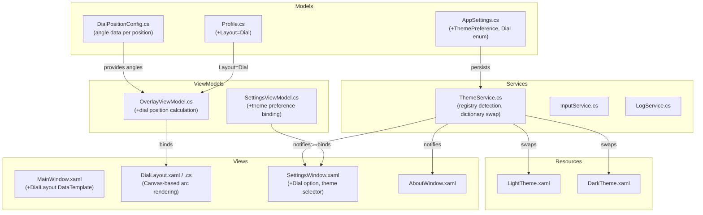

# Design Document: v0.6.0 Enhancements

## Overview

Version 0.6.0 adds two major feature groups to WheelOverlay:

1. **Dial Layout** — A skeuomorphic circular arc layout that mirrors the physical position arrangement of the Bavarian SimTec Alpha wheel's rotary dial. Positions 1–4 span the right arc (1 o'clock to 5 o'clock) and positions 5–8 span the left arc (7 o'clock to 11 o'clock), with a data-driven angle model so positions can be tuned during development.

2. **Dark/Light Mode Theming** — System-aware theming that reads the Windows `AppsUseLightTheme` registry key and applies matching WPF resource dictionaries to the Settings Window, About Window, and system tray. The overlay itself does NOT follow the system theme — it honors the user's per-profile text color settings. Users can override the system theme with a manual "System Default / Light / Dark" preference.

Both features integrate into the existing MVVM architecture, profile system, and JSON settings serialization with backward compatibility for pre-v0.6.0 settings files.

## Architecture



### Key Design Decisions

1. **Canvas-based dial rendering**: The dial layout uses a WPF `Canvas` with absolute positioning rather than a panel-based layout. Each label's (X, Y) is computed from its angle and a radius, giving precise circular placement. This is the simplest approach for arbitrary angular positioning.

2. **ThemeService as a singleton service**: A single `ThemeService` instance manages registry watching and resource dictionary swapping. It exposes a `ThemeChanged` event that windows subscribe to. This avoids scattering registry logic across multiple windows.

3. **Overlay excluded from theming**: The overlay window's colors come from the profile's `SelectedTextColor` / `NonSelectedTextColor` settings, not from theme resource dictionaries. This is intentional — sim racers configure overlay colors for visibility against their specific game backgrounds.

4. **Data-driven angle configuration**: Position angles live in a `DialPositionConfig` static data structure, not in XAML or rendering code. This lets the developer adjust angles during development without touching layout logic.

5. **Backward-compatible serialization**: New properties (`ThemePreference`, `Layout=Dial`) use default values so that pre-v0.6.0 settings files deserialize without error. The existing `FromJson` migration logic handles missing properties gracefully via `System.Text.Json` defaults.

## Components and Interfaces

### New Files

| File | Purpose |
|------|---------|
| `WheelOverlay/Models/DialPositionConfig.cs` | Static data structure mapping position index → angle in degrees |
| `WheelOverlay/Services/ThemeService.cs` | Registry-based theme detection, resource dictionary swapping, `ThemeChanged` event |
| `WheelOverlay/Views/DialLayout.xaml` + `.cs` | Canvas-based UserControl for dial arc rendering |
| `WheelOverlay/Resources/LightTheme.xaml` | Light mode color/style resource dictionary |
| `WheelOverlay/Resources/DarkTheme.xaml` | Dark mode color/style resource dictionary |

### Modified Files

| File | Changes |
|------|---------|
| `WheelOverlay/Models/AppSettings.cs` | Add `ThemePreference` enum and property; add `Dial` to `DisplayLayout` enum |
| `WheelOverlay/Models/Profile.cs` | No structural changes needed (Layout already uses `DisplayLayout` enum) |
| `WheelOverlay/ViewModels/OverlayViewModel.cs` | Add dial position calculation logic (angle → X,Y coordinates) |
| `WheelOverlay/ViewModels/SettingsViewModel.cs` | Add theme preference binding; hide grid controls when Dial is selected |
| `WheelOverlay/MainWindow.xaml` | Add `DialTemplate` DataTemplate and DataTrigger for `Layout=Dial` |
| `WheelOverlay/SettingsWindow.xaml` + `.cs` | Add theme selector combo; use DynamicResource for themed styles |
| `WheelOverlay/AboutWindow.xaml` + `.cs` | Use DynamicResource for themed styles |
| `WheelOverlay/App.xaml` | Merge initial theme resource dictionary |
| `WheelOverlay/App.xaml.cs` | Initialize `ThemeService`; pass to windows; subscribe to theme changes for tray icon swap |

### ThemeService Interface

```csharp
public enum ThemePreference
{
    System,  // Follow Windows setting
    Light,   // Force light
    Dark     // Force dark
}

public class ThemeService : IDisposable
{
    public event EventHandler<bool>? ThemeChanged; // true = dark mode
    
    public bool IsDarkMode { get; }
    public ThemePreference Preference { get; set; }
    
    public ThemeService(ThemePreference initialPreference);
    
    // Reads HKCU\...\AppsUseLightTheme registry key
    public bool DetectSystemTheme();
    
    // Swaps Application.Current.Resources.MergedDictionaries
    public void ApplyTheme(bool dark);
    
    // Starts registry key watcher (ManagementEventWatcher or polling timer)
    public void StartWatching();
    
    public void Dispose();
}
```

### DialPositionConfig Interface

```csharp
public static class DialPositionConfig
{
    // Default 8-position angles (0° = 12 o'clock, clockwise)
    // Right arc: Pos 1 ≈ 30°, Pos 2 ≈ 70°, Pos 3 ≈ 110°, Pos 4 ≈ 150°
    // Left arc:  Pos 5 ≈ 210°, Pos 6 ≈ 250°, Pos 7 ≈ 290°, Pos 8 ≈ 330°
    public static IReadOnlyDictionary<int, double> DefaultAngles { get; }
    
    // Returns angles for a given position count, falling back to even distribution
    public static IReadOnlyDictionary<int, double> GetAngles(int positionCount);
    
    // Converts angle + radius to (X, Y) offset from center
    public static (double X, double Y) AngleToPoint(double angleDegrees, double radius);
}
```


### DialLayout UserControl

The `DialLayout.xaml` UserControl uses a `Canvas` panel. On load and whenever the bound `OverlayViewModel` properties change, the code-behind (or a converter) computes each label's position:

```
for each position i in 1..PositionCount:
    angle = DialPositionConfig.GetAngles(positionCount)[i]
    (x, y) = AngleToPoint(angle, radius)
    place TextBlock at Canvas.Left=centerX+x, Canvas.Top=centerY+y
```

The radius is derived from the Canvas's `ActualWidth`/`ActualHeight`. Labels use the same `IsSelected` / flash animation pattern as existing layouts.

An optional rotary knob graphic (PNG/SVG) is centered on the Canvas behind the labels. This asset must be manually created and tested by the developer (Requirement 8.4).

## Data Models

### DisplayLayout Enum (Modified)

```csharp
public enum DisplayLayout
{
    Single,
    Vertical,
    Horizontal,
    Grid,
    Dial        // NEW in v0.6.0
}
```

### ThemePreference Enum (New)

```csharp
public enum ThemePreference
{
    System,     // Follow Windows AppsUseLightTheme
    Light,      // Force light mode
    Dark        // Force dark mode
}
```

### AppSettings (Modified)

```csharp
public class AppSettings
{
    // ... existing properties ...
    
    // NEW in v0.6.0
    public ThemePreference ThemePreference { get; set; } = ThemePreference.System;
}
```

The `JsonStringEnumConverter` already used in `FromJson` handles both new enum values. Missing properties in pre-v0.6.0 JSON files default to their C# default values (`ThemePreference.System`, existing `Layout` value unchanged).

### DialPositionConfig (New)

```csharp
public static class DialPositionConfig
{
    // Angles in degrees, 0° = 12 o'clock, increasing clockwise
    public static readonly IReadOnlyDictionary<int, double> DefaultAngles = 
        new Dictionary<int, double>
        {
            { 1,  30.0 },   // ~1 o'clock
            { 2,  70.0 },   // ~2:20
            { 3, 110.0 },   // ~3:40
            { 4, 150.0 },   // ~5 o'clock
            { 5, 210.0 },   // ~7 o'clock
            { 6, 250.0 },   // ~8:20
            { 7, 290.0 },   // ~9:40
            { 8, 330.0 },   // ~11 o'clock
        };
}
```

### Theme Resource Dictionary Keys

Both `LightTheme.xaml` and `DarkTheme.xaml` define these named resources:

| Resource Key | Type | Light Value | Dark Value |
|---|---|---|---|
| `ThemeBackground` | `SolidColorBrush` | `#FFFFFF` | `#1E1E1E` |
| `ThemeForeground` | `SolidColorBrush` | `#000000` | `#E0E0E0` |
| `ThemeControlBackground` | `SolidColorBrush` | `#F0F0F0` | `#2D2D2D` |
| `ThemeControlBorder` | `SolidColorBrush` | `#CCCCCC` | `#555555` |
| `ThemeControlForeground` | `SolidColorBrush` | `#000000` | `#E0E0E0` |
| `ThemeAccent` | `SolidColorBrush` | `#0078D4` | `#4CC2FF` |
| `ThemeDropShadow` | `Color` | `#40000000` | `#40000000` |

Windows that participate in theming (SettingsWindow, AboutWindow) reference these via `{DynamicResource ThemeBackground}` etc. The overlay window does NOT use these resources.


## Correctness Properties

*A property is a characteristic or behavior that should hold true across all valid executions of a system — essentially, a formal statement about what the system should do. Properties serve as the bridge between human-readable specifications and machine-verifiable correctness guarantees.*

### Property 1: Dial angle even distribution

*For any* position count N (2–20), the angles returned by `DialPositionConfig.GetAngles(N)` should have equal angular spacing between consecutive positions. For the default 8-position configuration, positions 1–4 should be evenly spaced within the right arc (approximately 30°–150°) and positions 5–8 should be evenly spaced within the left arc (approximately 210°–330°). For non-8 position counts (fallback), all N positions should be evenly distributed across the full 360° circle.

**Validates: Requirements 1.7, 3.3, 3.4**

### Property 2: Grid controls hidden for non-grid layouts

*For any* `DisplayLayout` value that is not `Grid`, the settings view model should indicate that grid-specific controls (rows, columns, suggested dimensions) are not applicable. Conversely, for `Grid` layout, grid controls should be applicable.

**Validates: Requirements 2.2**

### Property 3: Theme resolution from preference

*For any* combination of `ThemePreference` (System, Light, Dark) and detected system theme (light or dark), the effective theme should be: if preference is `Light`, effective is light; if preference is `Dark`, effective is dark; if preference is `System`, effective matches the detected system theme. The manual override must take precedence regardless of what the system reports.

**Validates: Requirements 7.2, 7.3, 7.5**

### Property 4: AppSettings serialization round-trip

*For any* valid `AppSettings` object (with any combination of `ThemePreference` values, `DisplayLayout` values including `Dial`, profile configurations, and text labels), serializing to JSON and then deserializing should produce an equivalent `AppSettings` object with all properties preserved.

**Validates: Requirements 9.1, 9.2, 9.4, 2.4, 7.4**

## Error Handling

| Scenario | Handling |
|----------|----------|
| Registry key `AppsUseLightTheme` missing or unreadable | `ThemeService.DetectSystemTheme()` returns `false` (light mode). Logged as warning. |
| Registry watcher fails to start (e.g., WMI unavailable) | Fall back to a polling timer (every 2 seconds). Logged as warning. |
| Pre-v0.6.0 settings file missing `ThemePreference` property | `System.Text.Json` defaults to `ThemePreference.System`. No error. |
| Pre-v0.6.0 settings file missing `Dial` layout value | Existing `Layout` value preserved. No error. |
| `DialPositionConfig.GetAngles()` called with position count > config entries | Falls back to even distribution across full arc. Logged as info. |
| Theme resource dictionary file missing or corrupt | Application continues with whatever resources are currently loaded. Logged as error. |
| Invalid `ThemePreference` string in JSON | `JsonStringEnumConverter` throws; caught by existing `FromJson` try/catch, returns default settings. |
| Canvas size is zero during dial layout rendering | Skip position calculation; labels remain at (0,0). Re-calculate on next `SizeChanged` event. |

## Testing Strategy

### Property-Based Testing

- **Library**: FsCheck 2.16.6 with FsCheck.Xunit (already in project)
- **Minimum iterations**: 100 per property (10 in `FAST_TESTS` configuration)
- **Tag format**: `Feature: v0.6.0-enhancements, Property {N}: {title}`

Each correctness property maps to exactly one property-based test:

| Property | Test File | What It Generates |
|----------|-----------|-------------------|
| Property 1: Dial angle even distribution | `DialPositionConfigPropertyTests.cs` | Random position counts (2–20); verifies equal angular spacing |
| Property 2: Grid controls hidden for non-grid layouts | `SettingsViewModelPropertyTests.cs` | Random `DisplayLayout` values; verifies grid control visibility flag |
| Property 3: Theme resolution from preference | `ThemeServicePropertyTests.cs` | Random `ThemePreference` × system theme combinations; verifies effective theme |
| Property 4: AppSettings serialization round-trip | `AppSettingsSerializationPropertyTests.cs` | Random `AppSettings` with all enum values including `Dial` and `ThemePreference`; serialize → deserialize → compare |

### Unit Tests

Unit tests complement property tests for specific examples and edge cases:

- **DialPositionConfig**: Verify default 8-position angles match expected approximate values (1.3, 1.4, 1.5, 1.6). Verify config structure has entries for positions 1–8 (3.2).
- **ThemeService**: Verify registry-missing fallback returns light mode (4.4). Verify `DetectSystemTheme()` returns expected values for known registry states (4.1).
- **AppSettings deserialization**: Verify pre-v0.6.0 JSON without new properties loads with correct defaults (9.3). Verify `Dial` enum value round-trips in JSON (2.5).
- **SettingsViewModel**: Verify `Dial` appears in layout options (2.1). Verify `ThemePreference` enum has three values (7.1).
- **Resource dictionaries**: Verify both `LightTheme.xaml` and `DarkTheme.xaml` contain all required resource keys (6.3).

### Test Configuration

```csharp
// Standard property test pattern for this feature
#if FAST_TESTS
[Property(MaxTest = 10)]
#else
[Property(MaxTest = 100)]
#endif
```

All new test files go in the `WheelOverlay.Tests/` directory alongside existing tests.
